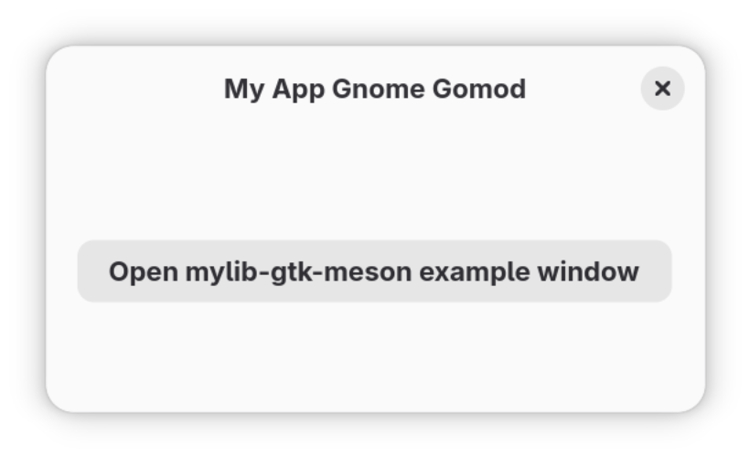

# myapp-gnome-gomod

This example implements a GNOME application using puregotk with the standard Go build system. For GTK applications, the [Meson build system](https://mesonbuild.com/) is commonly used instead, but using it is not required, and if you're just trying out GTK app development as a Go developer or trying to add a GTK app to an existing project, Meson might be confusing for you at first, which is why this example exists. For the functionally identical Meson-based example, see[../myapp-gnome-meson](../myapp-gnome-meson/). Like the Meson example, `myapp-gnome-gomod` uses the custom GTK widget from [../mylib-gtk-meson](../mylib-gtk-meson/) via the generated Go bindings from [../mylib-gtk-meson-go](../mylib-gtk-meson-go/). It also shows how to use Blueprint files, [GResources](https://docs.gtk.org/gio/struct.Resource.html) and `gettext` (for i18n) in puregotk-based applications.

First, make sure the `mylib-gtk-meson` library is built and installed on your system (see [../mylib-gtk-meson](../mylib-gtk-meson/) for instructions).

To then run the application using the standard Go build system, run:

```shell
go generate ./...

go run -ldflags="-X main.LocaleDir=\"${PWD}/po\"" ./src/
```

Note the `ldflags` flag; without using Meson, the `.mo` files for i18n don't get installed to `/usr/share/locale` automatically, so we instead point `gettext` to read them from the local directory instead. If you install them manually, that is not something you have to do.

Alternatively, you can build and run the application using Flatpak, which will also build `mylib-gtk-meson` for you and install the `.mo` files for i18n:

```shell
flatpak-builder --force-clean --force-clean --user --repo=repo --install builddir io.github.puregotk.MyAppGnomeGomod.json

flatpak run io.github.puregotk.MyAppGnomeMeson
```


