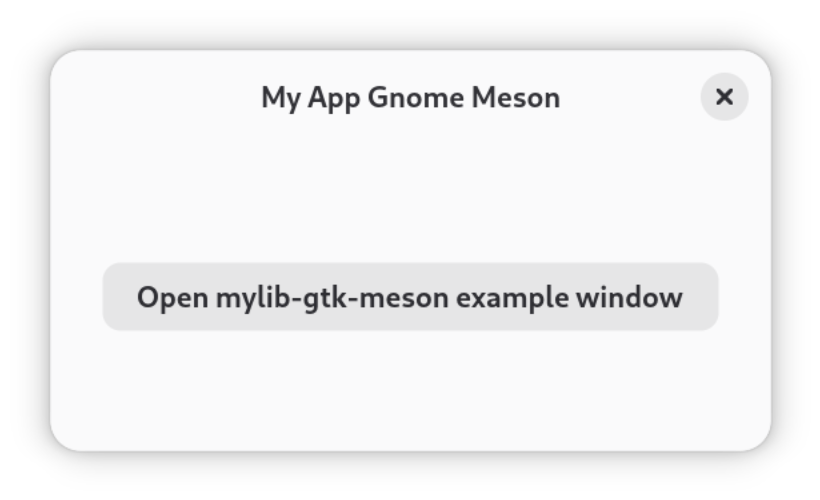

# myapp-gnome-meson

This example implements a GNOME application using puregotk with the [Meson build system](https://mesonbuild.com/), which is the default build system for GTK applications. It uses the custom GTK widget from [../mylib-gtk-meson](../mylib-gtk-meson/) via the generated Go bindings from [../mylib-gtk-meson-go](../mylib-gtk-meson-go/). It also shows how to use Blueprint files, [GResources](https://docs.gtk.org/gio/struct.Resource.html) and `gettext` (for i18n) in puregotk-based applications.

First, make sure the `mylib-gtk-meson` library is built and installed on your system (see [../mylib-gtk-meson](../mylib-gtk-meson/) for instructions).

To then build and install the application using Meson, run:

```shell
meson setup _build --prefix=/usr --wipe && meson compile -C _build && sudo meson install -C _build

myapp-gnome-meson
```



Alternatively, you can build and run the application using Flatpak, which will also build `mylib-gtk-meson` for you:

```shell
flatpak-builder --force-clean --force-clean --user --repo=repo --install builddir io.github.puregotk.MyAppGnomeMeson.json

flatpak run io.github.puregotk.MyAppGnomeMeson
```
