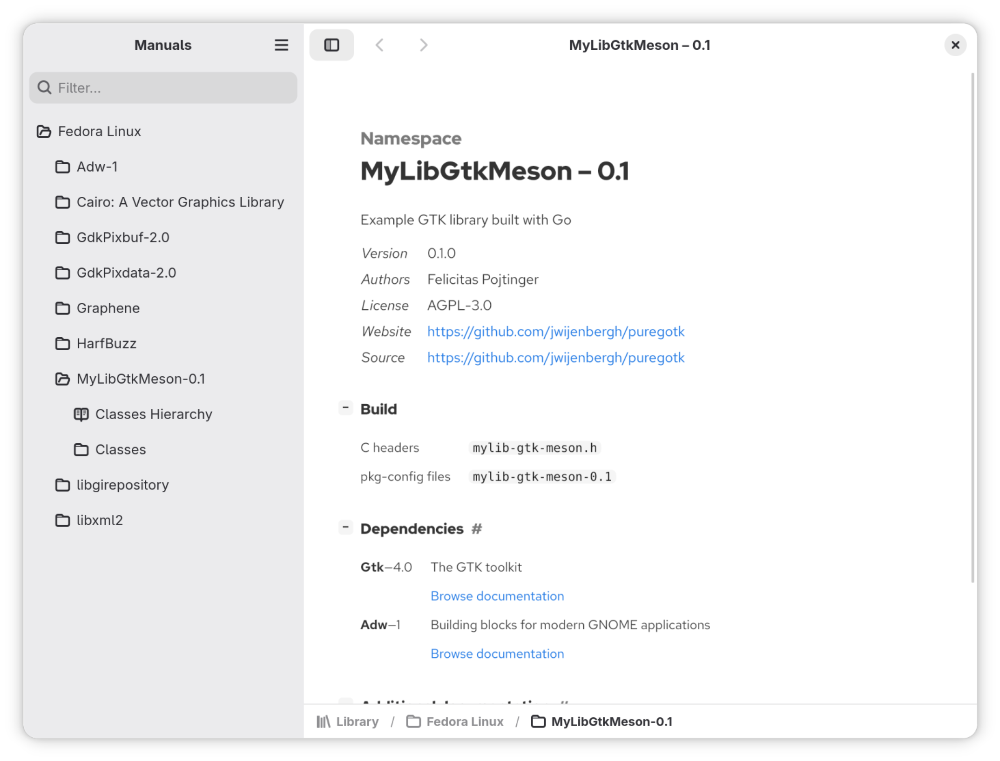
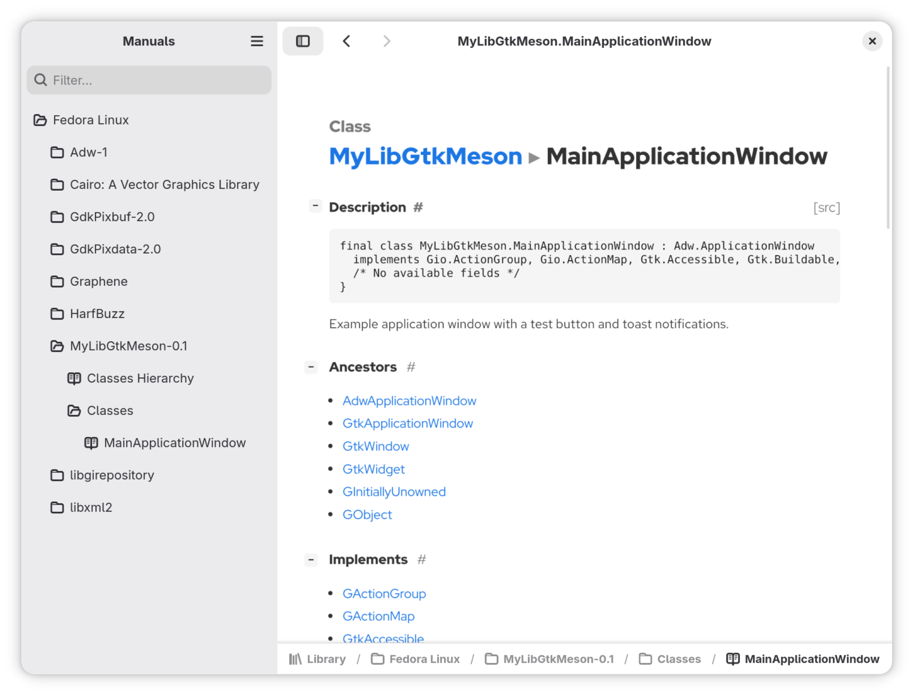
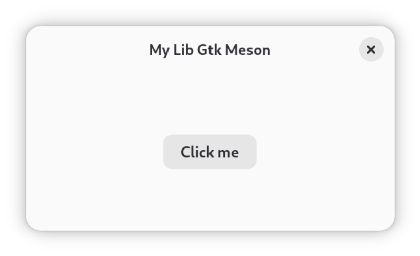

# mylib-gtk-meson

This example implements a GObject introspection-compatible library that provides a custom GTK widget with signals, methods and properties using puregotk. Once this library is built and installed alongside it's typelib file, you can use it from any other GObject introspection-compatible language, such as JavaScript or Python.

To build the library and install it, use Meson like so:

```shell
sudo ninja -C _build uninstall || true

meson setup _build --prefix=/usr --wipe && meson compile -C _build && sudo meson install -C _build
```

You can see which GObject resources it exposes by using [Manuals](https://flathub.org/en/apps/app.devsuite.Manuals):





How to use the library depends on the language, for JavaScript/GJS, see [example.js](./example.js), which you can launch like so:

```shell
./example.js
```

The GJS example app simply displays the custom widget written in Go, which looks like this:



Alternatively, you can also build the library and example using Flatpak and then start it like so:

```shell
flatpak-builder --force-clean --force-clean --user --repo=repo --install builddir io.github.puregotk.MyLibGtkMesonExample.json

flatpak run io.github.puregotk.MyLibGtkMesonExample
```

If you want to import the custom widget from Go, you'll have to generate bindings to the custom library using puregotk. For an example of how to do that, see [../mylib-gtk-meson-go](../mylib-gtk-meson-go/).
